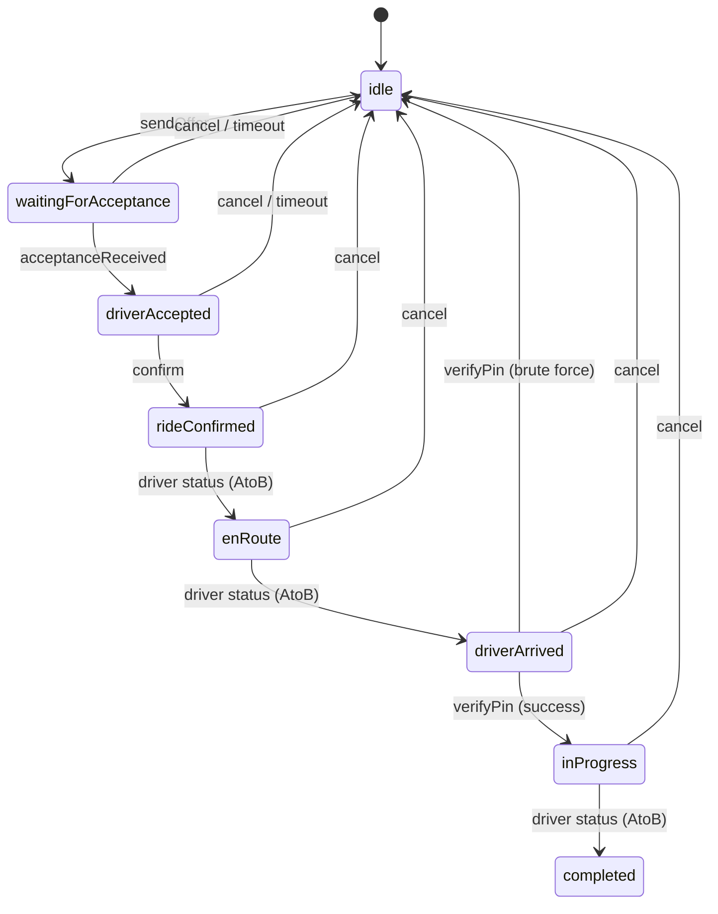

# RidestrSDK

A Swift Package implementing the [Ridestr](https://github.com/variablefate/ridestr) decentralized rideshare protocol on Nostr. Built on [rust-nostr](https://github.com/rust-nostr/nostr-sdk-swift) for relay management, event signing, and NIP-44 encryption.

**iOS 17+ | macOS 14+ | Swift 6.0 | 528 tests | 80%+ coverage**

## Quick Start

```swift
import RidestrSDK

// 1. Create or load identity
let keypair = try NostrKeypair.generate()

// 2. Connect to relays
let relay = RelayManager(keypair: keypair)
try await relay.connect(to: DefaultRelays.all)

// 3. Set up state machine
let stateMachine = RideStateMachine(riderPubkey: keypair.publicKeyHex)

// 4. Set up logging (optional)
RidestrLogger.handler = { level, message, _, _ in
    print("[\(level.label)] \(message)")
}

// 5. Build and publish a ride offer
// fareEstimate is in satoshis; fiatFare carries the authoritative USD amount for fiat rides.
// For bitcoin-native rides (fiatPaymentMethods empty), omit fiatFare (defaults to nil).
let fareInSats: Double = 50_000  // computed from USD using your own BTC/USD price service (e.g., CoinGecko, Coinbase)
let content = RideOfferContent(
    fareEstimate: fareInSats,
    fiatFare: FiatFare(amount: "12.50", currency: "USD"),
    destination: Location(latitude: 40.758, longitude: -73.985),
    approxPickup: Location(latitude: 40.710, longitude: -74.010),
    paymentMethod: "zelle",
    fiatPaymentMethods: ["zelle", "venmo"]
)
let offer = try await RideshareEventBuilder.rideOffer(
    driverPubkey: "64-char-hex-pubkey...",
    driverAvailabilityEventId: nil,
    content: content,
    keypair: keypair
)
try await relay.publish(offer)
```

## Architecture

```mermaid
graph TD
    subgraph SDK["RidestrSDK"]
        subgraph Nostr["Nostr Layer"]
            RM[RelayManager<br/><i>actor</i>]
            ES[EventSigner]
            NIP[NIP-44 Encryption]
            EB[RideshareEventBuilder]
            EP[RideshareEventParser]
            KM[KeyManager<br/><i>actor</i>]
            RC[RemoteConfigManager<br/><i>actor</i>]
        end

        subgraph Ride["Ride Layer"]
            SM[RideStateMachine<br/><i>@Observable</i>]
            TT[RideTransitions<br/><i>transition table</i>]
            RG[RideGuards]
            RE[RideEvent]
            CTX[RideContext<br/><i>immutable struct</i>]
        end

        subgraph Location["Location Layer"]
            GH[Geohash]
            FC[FareCalculator]
            RS[RoutingServiceProtocol]
            GS[GeocodingServiceProtocol]
            PR[ProgressiveReveal]
        end

        subgraph RoadFlare["RoadFlare Layer"]
            FDR[FollowedDriversRepository<br/><i>@Observable + NSLock</i>]
        end

        subgraph Storage["Storage"]
            KC[KeychainStorage]
        end

        subgraph Models["Models"]
            RiderStage
            PaymentMethod
            NostrEvent
            RidestrError
        end
    end

    SM -->|processEvent| TT
    TT -->|evaluate| RG
    SM -->|AtoB pattern| CTX
    EB -->|encrypt| NIP
    EP -->|decrypt| NIP
    EB -->|sign| ES
    KM -->|persist| KC
    RM -->|publish/subscribe| ES
    FC -->|calculate| RS
    FDR -->|sync| RM
```

## State Machine

The ride lifecycle is managed by `RideStateMachine` with two entry points:



**Rider actions** (solid arrows) go through `processEvent()` with transition table + guards.
**Driver status** (AtoB arrows) goes through `receiveDriverStateEvent()` — the driver is the source of truth.

## Error Handling

Errors are organized by domain for pattern matching:

```swift
do {
    try await relay.publish(event)
} catch let error as RidestrError {
    switch error {
    case .relay(let e):
        // Connection failed, not connected, timeout
    case .crypto(let e):
        // Encryption, decryption, signing, invalid key
    case .ride(let e):
        // State machine violation, invalid event
    case .keychain(let e):
        // OS error, data corrupted
    case .location(let e):
        // Invalid geohash, route calculation, geocoding
    case .profile(let e):
        // Sync failed
    }
}
```

## Testing

The SDK provides mock implementations for all protocol dependencies:

| Protocol | Production | Mock / Test |
|----------|-----------|-------------|
| `RelayManagerProtocol` | `RelayManager` (actor) | `FakeRelayManager` (test target) |
| `RoutingServiceProtocol` | App provides (MapKit) | `HaversineRoutingService` |
| `GeocodingServiceProtocol` | App provides (CLGeocoder) | `StubGeocodingService` |
| `FollowedDriversPersistence` | App provides (UserDefaults) | `InMemoryFollowedDriversPersistence` |
| `KeychainStorageProtocol` | `KeychainStorage` | `FakeKeychainStorage` (test target) |

## Type Safety

Key identifiers use type aliases for self-documenting code:

```swift
public typealias PublicKeyHex = String        // 64-char hex Nostr public key
public typealias EventID = String             // 64-char hex event ID
public typealias ConfirmationEventID = String // Kind 3175 event ID (ride identifier)
```

All builder methods validate inputs at the boundary:
```swift
// Throws RidestrError.crypto(.invalidKey(...)) if pubkey isn't 64 hex chars
try RideshareEventBuilder.validatePubkey(driverPubkey)
```

## Cross-Platform

Fully interoperable with the [Android Ridestr app](https://github.com/variablefate/ridestr). All event kinds, JSON field names (CodingKeys), driver status strings, tag formats, and NIP-44 encryption are verified to match exactly. 40+ cross-platform fixture tests ensure ongoing compatibility.

## Requirements

- iOS 17.0+ / macOS 14.0+
- Swift 6.0+
- Xcode 16.0+
- [nostr-sdk-swift](https://github.com/rust-nostr/nostr-sdk-swift) 0.44.0+

## Installation

Add to your `Package.swift`:

```swift
dependencies: [
    .package(url: "https://github.com/variablefate/roadflare-ios.git", from: "0.2.0"),
]
```

Then add `RidestrSDK` as a dependency of your target.
